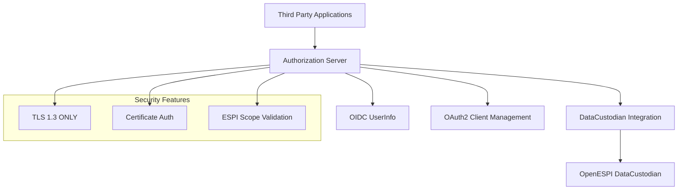

# OpenESPI Authorization Server Documentation

Welcome to the comprehensive documentation for the OpenESPI Authorization Server, a NAESB ESPI 4.0 compliant OAuth2/OIDC authorization server for Green Button Alliance applications.

## 📋 Documentation Index

### Core Documentation

| Document | Description | Audience |
|----------|-------------|----------|
| **[API Documentation](API_DOCUMENTATION.md)** | Complete API reference with endpoints, schemas, and examples | Developers, Integration Teams |
| **[Integration Guide](INTEGRATION_GUIDE.md)** | Step-by-step integration instructions with code examples | Developers |
| **[ESPI Compliance Guide](ESPI_COMPLIANCE_GUIDE.md)** | NAESB ESPI 4.0 compliance requirements and implementation | Compliance Officers, Architects |
| **[OpenAPI Specification](openapi.yaml)** | Machine-readable API specification | API Tools, Developers |

### Feature-Specific Documentation

| Document | Description |
|----------|-------------|
| **[OIDC UserInfo Endpoint](OIDC_USERINFO_ENDPOINT.md)** | UserInfo endpoint with ESPI claims |
| **[Migration Roadmap](MIGRATION_ROADMAP.md)** | Spring Boot 3.5 migration plan |

## 🚀 Quick Start

### For Developers
1. Read the **[Integration Guide](INTEGRATION_GUIDE.md)** for implementation steps
2. Review **[API Documentation](API_DOCUMENTATION.md)** for endpoint details
3. Use the **[OpenAPI Specification](openapi.yaml)** to generate client SDKs

### For Compliance Teams
1. Start with **[ESPI Compliance Guide](ESPI_COMPLIANCE_GUIDE.md)**
2. Review security requirements in **[API Documentation](API_DOCUMENTATION.md#security-requirements)**
3. Validate implementation against compliance checklist

### For System Administrators
1. Review deployment requirements in **[Migration Roadmap](MIGRATION_ROADMAP.md)**
2. Configure security settings per **[ESPI Compliance Guide](ESPI_COMPLIANCE_GUIDE.md)**
3. Set up monitoring using health check endpoints

## 🏗️ Architecture Overview

The OpenESPI Authorization Server provides:

- **OAuth2/OIDC Authorization**: Standards-compliant authorization server
- **ESPI 4.0 Compliance**: Full NAESB ESPI 4.0 support with TLS 1.3
- **DataCustodian Integration**: Seamless integration with OpenESPI DataCustodian
- **Certificate Authentication**: X.509 client certificate support
- **Green Button Alliance Extensions**: Specialized claims and scopes

### Key Components



## 📊 API Overview

### Core Endpoints

| Endpoint Category | Base Path | Purpose |
|------------------|-----------|---------|
| **OAuth2 Standard** | `/oauth2/*` | Standard OAuth2 endpoints |
| **Client Management** | `/api/v1/oauth2/clients` | OAuth2 client registration and management |
| **DataCustodian Integration** | `/api/v1/datacustodian` | Integration with OpenESPI DataCustodian |
| **OIDC UserInfo** | `/userinfo` | OpenID Connect user information with ESPI claims |

### Authentication Methods

- **Bearer Token**: API access with OAuth2 access tokens
- **Basic Authentication**: Client credentials for OAuth2 flows
- **Certificate Authentication**: X.509 client certificates (ESPI 4.0)

## 🔒 Security Features

### ESPI 4.0 Compliance

- ✅ **TLS 1.3 ONLY**: Mandatory for all communications
- ✅ **Perfect Forward Secrecy**: Required cipher suites
- ✅ **Certificate Authentication**: X.509 client certificate support
- ✅ **ESPI Scope Validation**: Green Button scope format validation
- ✅ **Audit Logging**: Comprehensive security event logging

### Additional Security

- Rate limiting per client and endpoint
- Comprehensive audit trails
- Token introspection and revocation
- PKCE support for public clients
- Data minimization based on granted scopes

## 🔧 Configuration Examples

### Basic OAuth2 Client Registration

```json
{
  "clientName": "My Energy App",
  "redirectUris": ["https://myapp.com/callback"],
  "scopes": [
    "openid",
    "profile", 
    "FB=4_5_15;IntervalDuration=3600;BlockDuration=monthly;HistoryLength=13"
  ],
  "espiCompliant": true
}
```

### ESPI Scope Examples

```bash
# Hourly data, monthly billing, 13 months history
FB=4_5_15;IntervalDuration=3600;BlockDuration=monthly;HistoryLength=13

# 15-minute data, daily billing, 30 days history  
FB=4_5_15;IntervalDuration=900;BlockDuration=daily;HistoryLength=30
```

## 📈 Monitoring and Health Checks

### Health Endpoints

- `/actuator/health` - Overall application health
- `/actuator/health/espi-compliance` - ESPI compliance status
- `/api/v1/datacustodian/health` - DataCustodian integration health

### Metrics

- OAuth2 token issuance rates
- ESPI scope usage analytics
- Certificate authentication metrics
- DataCustodian integration performance

## 🧪 Testing

### Test Categories

1. **Unit Tests**: Component-level testing
2. **Integration Tests**: Full OAuth2 flow testing
3. **Compliance Tests**: ESPI 4.0 validation
4. **Performance Tests**: Load and stress testing
5. **Security Tests**: Penetration and vulnerability testing

### Test Tools

- **Postman Collections**: API testing collections available
- **Compliance Test Suite**: ESPI validation tests
- **Load Testing Scripts**: Performance validation tools

## 📚 Standards and Specifications

### Supported Standards

| Standard | Version | Compliance Level |
|----------|---------|------------------|
| **OAuth2** | RFC 6749 | Full |
| **OpenID Connect** | 1.0 | Core + Discovery |
| **NAESB ESPI** | 4.0 | Certified |
| **Green Button Alliance** | 2024.1 | Full |
| **TLS** | 1.3 | Required |

### Related Specifications

- [RFC 6749 - OAuth 2.0 Authorization Framework](https://tools.ietf.org/html/rfc6749)
- [OpenID Connect Core 1.0](https://openid.net/specs/openid-connect-core-1_0.html)
- [NAESB ESPI 4.0 Specification](https://www.naesb.org/espi)
- [Green Button Alliance Connect My Data](https://www.greenbuttonalliance.org/connect-my-data)

## 🆘 Support and Resources

### Documentation

- **API Reference**: Complete endpoint documentation with examples
- **Integration Guides**: Step-by-step implementation guides
- **Compliance Guides**: ESPI 4.0 compliance requirements
- **Troubleshooting**: Common issues and solutions

### Community Resources

- **GitHub Repository**: [OpenESPI Authorization Server](https://github.com/greenbuttonalliance/openespi-authorization-server)
- **Issue Tracker**: Report bugs and request features
- **Community Forum**: [Green Button Alliance Community](https://community.greenbuttonalliance.org)
- **Slack Channel**: Real-time developer support

### Professional Support

- **Green Button Alliance Membership**: Priority support and certification
- **Training Programs**: Developer certification courses
- **Consulting Services**: Implementation and compliance consulting

## 📋 Compliance Checklist

### ESPI 4.0 Requirements

- [ ] TLS 1.3 ONLY configuration verified
- [ ] Perfect Forward Secrecy cipher suites enabled
- [ ] Certificate-based client authentication implemented
- [ ] ESPI scope format validation active
- [ ] Green Button Alliance membership active
- [ ] Compliance documentation complete
- [ ] Security audit passed
- [ ] Performance benchmarks met

### Implementation Checklist

- [ ] OAuth2 client registered
- [ ] Authorization code flow implemented
- [ ] Token refresh handling implemented
- [ ] UserInfo endpoint integration complete
- [ ] Error handling implemented
- [ ] Security measures implemented
- [ ] Testing completed
- [ ] Production deployment ready

## 🔄 Version Information

| Component | Version | Release Date |
|-----------|---------|--------------|
| **Authorization Server** | 1.0.0 | 2024-01-16 |
| **Spring Boot** | 3.5.0 | 2024-01-15 |
| **Spring Authorization Server** | 1.3.2 | 2024-01-10 |
| **ESPI Compliance** | 4.0 | Certified |
| **Documentation** | 1.0.0 | 2024-01-16 |

## 📝 License and Legal

This project is licensed under the Apache License 2.0. See the LICENSE file for details.

### Copyright Notice

```
Copyright (c) 2018-2025 Green Button Alliance, Inc.
Portions (c) 2013-2018 EnergyOS.org

Licensed under the Apache License, Version 2.0 (the "License");
you may not use this file except in compliance with the License.
You may obtain a copy of the License at

    http://www.apache.org/licenses/LICENSE-2.0

Unless required by applicable law or agreed to in writing, software
distributed under the License is distributed on an "AS IS" BASIS,
WITHOUT WARRANTIES OR CONDITIONS OF ANY KIND, either express or implied.
See the License for the specific language governing permissions and
limitations under the License.
```

---

**Need help?** 
- 📖 Start with the [Integration Guide](INTEGRATION_GUIDE.md)
- 🔍 Search the [API Documentation](API_DOCUMENTATION.md)
- 💬 Join our [Community Forum](https://community.greenbuttonalliance.org)
- 🐛 Report issues on [GitHub](https://github.com/greenbuttonalliance/openespi-authorization-server/issues)

*Last updated: January 16, 2024*