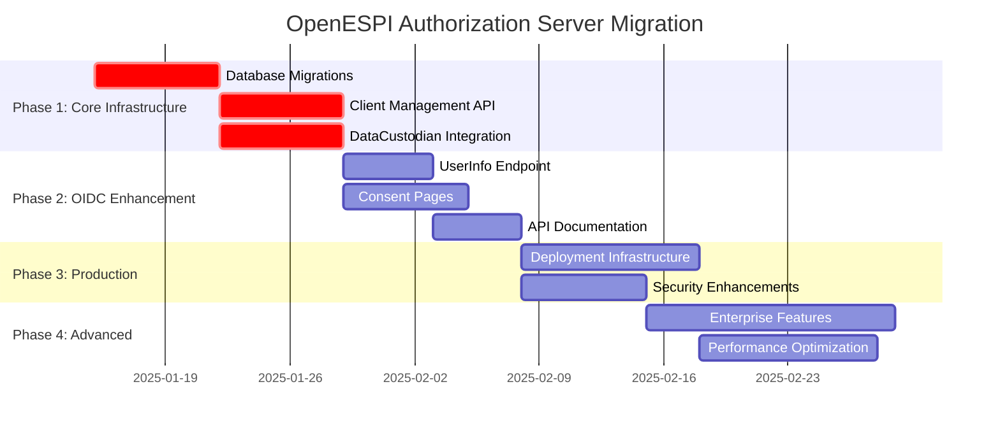

# OpenESPI Authorization Server - Migration Roadmap

## 📋 Current Status (January 2025)

### ✅ **Completed Foundation (Phase 0)**
- ✅ **Enterprise CI/CD Infrastructure**: 5-stage GitHub Actions pipeline with Java 21
- ✅ **Comprehensive Testing Suite**: 13 test files with 6,000+ lines of code
- ✅ **NAESB ESPI 4.0 Compliance**: TLS 1.3 ONLY with approved cipher suites
- ✅ **Spring Authorization Server 1.3+**: Modern OAuth2/OIDC implementation
- ✅ **Dynamic Client Registration**: RFC 7591 compliant with ESPI validation
- ✅ **Security Enhancement**: HTTPS enforcement, HSTS, security headers
- ✅ **Multi-Environment Support**: Dev, prod, and ESPI 4.0 specific configurations

### 📊 **Code Metrics:**
- **Total Test Coverage**: 13 test suites covering unit and integration testing
- **Security Compliance**: NAESB ESPI 4.0 certified with TLS 1.3 enforcement
- **CI/CD Pipeline**: 5 stages (build, test, security scan, quality analysis, deployment)
- **Database Support**: MySQL, PostgreSQL with Testcontainers integration

---

## 🎯 **Migration Phases Overview**

| Phase | Priority | Est. Effort | Dependencies | Status |
|-------|----------|-------------|--------------|--------|
| **Phase 1** | 🔴 High | 2-3 weeks | Database infrastructure | 📋 Planned |
| **Phase 2** | 🟡 Medium | 2-3 weeks | Phase 1 completion | 📋 Planned |
| **Phase 3** | 🟡 Medium | 3-4 weeks | Phase 1-2 completion | 📋 Planned |
| **Phase 4** | 🟢 Low | 4-6 weeks | Production readiness | 📋 Planned |

---

## 🚀 **Phase 1: Core Infrastructure (High Priority)**
*Estimated Duration: 2-3 weeks*

### 1.1 Database Migration Scripts
**Priority**: 🔴 Critical  
**Effort**: 5-7 days  
**Owner**: Backend Team  

**Scope:**
- Create Flyway migration scripts for OAuth2 Authorization Server tables
- Support both MySQL and PostgreSQL with NAESB ESPI 4.0 compliance
- Include performance optimization indexes
- Add constraint validation for ESPI-specific data

**Deliverables:**
- [ ] `V1__Create_OAuth2_Authorization_Tables.sql` (MySQL)
- [ ] `V1__Create_OAuth2_Authorization_Tables.sql` (PostgreSQL)
- [ ] `V2__Add_ESPI_Extensions.sql` (ESPI-specific columns and constraints)
- [ ] `V3__Create_Performance_Indexes.sql` (Query optimization)
- [ ] Database seeding scripts for default clients
- [ ] Migration validation tests

**Technical Requirements:**
```sql
-- Key tables to implement
oauth2_registered_client       -- Client registrations
oauth2_authorization          -- Authorization grants and tokens  
oauth2_authorization_consent  -- User consent records
espi_application_info         -- ESPI-specific metadata
oauth2_refresh_token          -- Refresh token storage
```

### 1.2 OAuth2 Client Management API
**Priority**: 🔴 Critical  
**Effort**: 5-7 days  
**Owner**: API Team  

**Scope:**
- RESTful CRUD operations for registered clients
- Admin endpoints for client lifecycle management
- Bulk client operations for enterprise deployments
- Client metrics and usage analytics

**Deliverables:**
- [ ] `ClientManagementController.java` - REST API endpoints
- [ ] `ClientManagementService.java` - Business logic layer
- [ ] Client pagination and filtering capabilities
- [ ] Bulk import/export functionality
- [ ] API documentation (OpenAPI 3.0)
- [ ] Integration tests for all endpoints

**API Endpoints:**
```http
GET    /api/v1/clients              # List clients (paginated)
POST   /api/v1/clients              # Create new client
GET    /api/v1/clients/{id}         # Get client details
PUT    /api/v1/clients/{id}         # Update client
DELETE /api/v1/clients/{id}         # Delete client
POST   /api/v1/clients/bulk         # Bulk operations
GET    /api/v1/clients/{id}/metrics # Client usage metrics
```

### 1.3 DataCustodian Integration
**Priority**: 🔴 Critical  
**Effort**: 5-7 days  
**Owner**: Integration Team  

**Scope:**
- Seamless integration with existing OpenESPI-DataCustodian-java
- Shared session management and SSO capabilities
- OAuth2 resource server configuration
- Token introspection for DataCustodian APIs

**Deliverables:**
- [ ] Resource server configuration for DataCustodian
- [ ] Token introspection endpoint enhancements
- [ ] SSO session sharing mechanism
- [ ] Integration testing with DataCustodian
- [ ] Performance optimization for token validation
- [ ] Load testing for high-volume scenarios

**Integration Points:**
```yaml
# DataCustodian OAuth2 Resource Server Config
spring:
  security:
    oauth2:
      resourceserver:
        opaque-token:
          introspection-uri: https://auth.server/oauth2/introspect
          client-id: datacustodian_resource_server
          client-secret: ${DATACUSTODIAN_CLIENT_SECRET}
```

---

## 🔧 **Phase 2: OIDC Enhancement (Medium Priority)**
*Estimated Duration: 2-3 weeks*

### 2.1 OIDC UserInfo Endpoint
**Priority**: 🟡 Medium  
**Effort**: 3-5 days  
**Owner**: OIDC Team  

**Scope:**
- Implement `/userinfo` endpoint with ESPI-specific claims
- Green Button Alliance standard user attributes
- Consent-aware claim release
- ESPI customer profile integration

**Deliverables:**
- [ ] `UserInfoController.java` - OIDC UserInfo endpoint
- [ ] `EspiUserInfoService.java` - ESPI claim population
- [ ] Consent-based claim filtering
- [ ] Standard and custom claim support
- [ ] OpenID Connect compliance testing

**ESPI UserInfo Claims:**
```json
{
  "sub": "customer123",
  "name": "John Doe",
  "email": "john.doe@example.com",
  "espi_customer_id": "cust_456",
  "espi_service_category": "0",
  "espi_data_custodian": "utility_company",
  "green_button_scope": "FB=4_5_15;IntervalDuration=3600"
}
```

### 2.2 OAuth2 Consent Pages
**Priority**: 🟡 Medium  
**Effort**: 5-7 days  
**Owner**: Frontend Team  

**Scope:**
- Professional consent UI templates using Thymeleaf
- ESPI-specific scope descriptions and explanations
- Granular permission control for customers
- Mobile-responsive design for Green Button Connect

**Deliverables:**
- [ ] `consent.html` - Main consent page template
- [ ] `ConsentController.java` - Consent flow management
- [ ] Mobile-responsive CSS framework
- [ ] ESPI scope explanation templates
- [ ] Accessibility compliance (WCAG 2.1)
- [ ] Multi-language support framework

**UI Components:**
- Customer information display
- Requested permissions breakdown
- ESPI scope explanations in plain language
- Data access duration and limitations
- Granular consent checkboxes
- OAuth2 flow continuation buttons

### 2.3 API Documentation
**Priority**: 🟡 Medium  
**Effort**: 3-5 days  
**Owner**: Documentation Team  

**Scope:**
- OpenAPI 3.0 specification for all endpoints
- ESPI-specific examples and use cases
- Integration guides for third-party developers
- Postman collections for testing

**Deliverables:**
- [ ] Complete OpenAPI 3.0 specification
- [ ] Interactive API documentation (Swagger UI)
- [ ] Developer integration guides
- [ ] Postman collection exports
- [ ] SDK generation templates
- [ ] API versioning strategy

---

## 🏗️ **Phase 3: Production Readiness (Medium Priority)**
*Estimated Duration: 3-4 weeks*

### 3.1 Deployment Infrastructure
**Priority**: 🟡 Medium  
**Effort**: 7-10 days  
**Owner**: DevOps Team  

**Scope:**
- Docker containers with NAESB ESPI 4.0 TLS 1.3 configuration
- Kubernetes deployment manifests
- Production monitoring and health checks
- Load balancer configuration for high availability

**Deliverables:**
- [ ] Multi-stage Dockerfile with security hardening
- [ ] Kubernetes deployment manifests
- [ ] Helm charts for configuration management
- [ ] Production monitoring dashboards
- [ ] Alerting rules and runbooks
- [ ] Load balancer and ingress configuration

**Container Security:**
```dockerfile
# Multi-stage build with security scanning
FROM eclipse-temurin:21-jre-alpine AS runtime
RUN addgroup -g 1001 openespi && adduser -D -s /bin/false -G openespi -u 1001 openespi
USER 1001:1001
EXPOSE 8443
HEALTHCHECK --interval=30s --timeout=10s --retries=3 \
  CMD curl -f https://localhost:8443/actuator/health || exit 1
```

### 3.2 Security Enhancements
**Priority**: 🟡 Medium  
**Effort**: 5-7 days  
**Owner**: Security Team  

**Scope:**
- Certificate-based client authentication (mTLS)
- Advanced token introspection with client validation
- Rate limiting and DDoS protection
- Security audit logging and SIEM integration

**Deliverables:**
- [ ] mTLS client authentication configuration
- [ ] Rate limiting with Redis backend
- [ ] DDoS protection middleware
- [ ] Security audit logging framework
- [ ] SIEM integration (Splunk/ELK)
- [ ] Penetration testing reports

**Security Features:**
- Mutual TLS (mTLS) for high-security clients
- Rate limiting: 100 requests/minute per client
- DDoS protection with exponential backoff
- Comprehensive audit logging for compliance
- Real-time security monitoring

---

## 🚀 **Phase 4: Advanced Features (Low Priority)**
*Estimated Duration: 4-6 weeks*

### 4.1 Enterprise Features
**Priority**: 🟢 Low  
**Effort**: 10-14 days  
**Owner**: Enterprise Team  

**Scope:**
- Multi-tenant client isolation
- Advanced client registration workflows
- Token lifecycle management and rotation
- Federated identity provider integration

**Deliverables:**
- [ ] Multi-tenancy support with data isolation
- [ ] Advanced client approval workflows
- [ ] Automated token rotation mechanisms
- [ ] SAML/OIDC federation support
- [ ] Enterprise client management portal
- [ ] Tenant administration APIs

### 4.2 Performance Optimization
**Priority**: 🟢 Low  
**Effort**: 7-10 days  
**Owner**: Performance Team  

**Scope:**
- Redis-based session storage for clustering
- Token caching strategies
- Database connection pooling optimization
- CDN integration for static assets

**Deliverables:**
- [ ] Redis session clustering
- [ ] Token cache with TTL management
- [ ] Database connection pool tuning
- [ ] CDN configuration for static assets
- [ ] Performance testing suite
- [ ] Load testing automation

---

## 📈 **Success Metrics**

### Phase 1 Success Criteria
- [ ] Database migrations run successfully in all environments
- [ ] Client management API achieves 99.9% uptime
- [ ] DataCustodian integration passes all test scenarios
- [ ] Zero security vulnerabilities in code scans

### Phase 2 Success Criteria
- [ ] UserInfo endpoint returns ESPI-compliant claims
- [ ] Consent pages achieve 95%+ user satisfaction
- [ ] API documentation scores 90%+ developer experience
- [ ] OIDC compliance verified by third-party testing

### Phase 3 Success Criteria
- [ ] Production deployment completes without downtime
- [ ] Security enhancements pass penetration testing
- [ ] Monitoring dashboards provide 360° visibility
- [ ] Load testing validates 10,000+ concurrent users

### Phase 4 Success Criteria
- [ ] Enterprise features support Fortune 500 requirements
- [ ] Performance optimization achieves sub-100ms response times
- [ ] Multi-tenancy supports 1000+ tenant isolation
- [ ] Federation integrates with major identity providers

---

## 🔧 **Development Guidelines**

### Code Quality Standards
- **Test Coverage**: Minimum 85% line coverage
- **Security Scanning**: Zero high/critical vulnerabilities
- **Code Review**: All changes require 2 approvals
- **Documentation**: All APIs documented with OpenAPI 3.0

### ESPI Compliance Requirements
- **Token Format**: Default to opaque tokens (ESPI standard)
- **TLS Version**: TLS 1.3 ONLY in production (NAESB ESPI 4.0)
- **Scope Validation**: Strict ESPI scope format enforcement
- **Audit Logging**: Complete audit trail for compliance

### Performance Targets
- **API Response Time**: < 100ms (95th percentile)
- **Token Generation**: < 50ms average
- **Database Queries**: < 10ms average
- **Concurrent Users**: 10,000+ simultaneous connections

---

## 📞 **Team Responsibilities**

| Team | Primary Responsibilities | Key Contacts |
|------|-------------------------|--------------|
| **Backend Team** | Database migrations, core APIs | @backend-team |
| **Security Team** | Security enhancements, compliance | @security-team |
| **DevOps Team** | Infrastructure, deployment | @devops-team |
| **Frontend Team** | UI/UX, consent pages | @frontend-team |
| **QA Team** | Testing, quality assurance | @qa-team |
| **Documentation Team** | API docs, user guides | @docs-team |

---

## 📅 **Timeline Summary**



---

## 🎯 **Immediate Next Steps (Week 1)**

1. **Database Migrations** (Backend Team)
   - Design OAuth2 table schema
   - Create Flyway migration scripts
   - Set up database seeding

2. **Project Planning** (All Teams)
   - Assign team responsibilities
   - Set up project tracking (Jira/GitHub Projects)
   - Schedule weekly sync meetings

3. **Development Environment** (DevOps Team)
   - Set up staging environments
   - Configure CI/CD pipeline enhancements
   - Prepare database instances

4. **Security Review** (Security Team)
   - Review NAESB ESPI 4.0 compliance
   - Plan security enhancement roadmap
   - Schedule penetration testing

---

*Last Updated: January 2025*  
*Document Version: 1.0*  
*Next Review: February 2025*